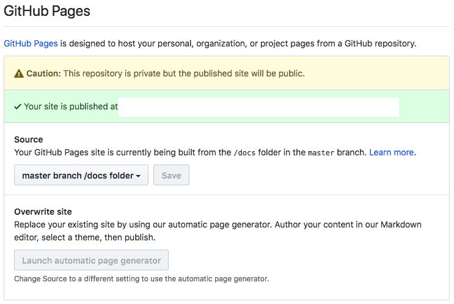

# Sphinx to GitHub Pages

## Introduction
[Sphinx](http://www.sphinx-doc.org/en/master/) is a wonderful tool for making readable documentation for your projects. Unfortunately if you follow the guide for Sphinx, your end product won't be immediately interoperable with tools like [GitHub Pages](https://pages.github.com/). I made the script and instructions included here to help streamline the process of building GitHub Pages compatible Sphinx documentation in the future.

## Before Running the Script
Before you run the shell script, make sure to follow these steps to ensure that your environment is setup correctly. In this guide it is assumed that you used `sphinx-quickstart` to create your documentation.

1. Move all your Sphinx related content to a directory called docs/ in your project.
2. Move your Sphinx source files to a new directory in docs/ called src/. Source files include files and directories like conf.py, \*.rst, \*.md, \_static/, \_templates/, and your Makefile.
3. In your Makefile, change the line

        BUILDDIR      = \_build

  to

        BUILDDIR      = ..

  This will tell Sphinx to build directly to the /docs directory.
4. Copy the make_github_pages.sh file from the repository into src/ folder.

## Running the Script
Once those steps are complete you should be ready to run the bash script! Execute the script using `sh make_github_pages.sh`. It will remove all previous build files excluding your src/ folder and then build Sphinx directly into the docs/ folder.

Commit and push your code to your repository and then navigate to "Settings" in GitHub. Find the GitHub Pages section and then enable Source to use the /docs folder of your master branch as shown below.

